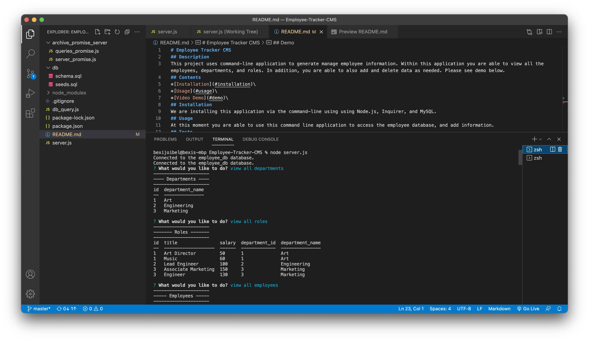

# Employee Tracker CMS
## Description
This project uses command-line application to generate manage employee information. Within this application you are able to view all the employees, departments, and roles. In addition, you are able to also add and delete data as needed. Please see demo below.
## Contents
*[Installation](#installation)\
*[Usage](#usage)\
*[Video Demo](#demo)
## Installation 
We are installing this application via the command-line using using Node.js, Inquirer, and MySQL.
## Usage
At this moment you are able to use this command line application to access the employee database, and add information.

#### Start application

First run mysql on your command line in order to access your database
By using the command node server.js

## Question
If you have any questions, please feel free to reach out via:\
GitHub: https://github.com/thechicketarian/ \
Email: thechicketarian@gmail.com
## Demo 

[View Demo Video](https://vimeo.com/718614079)\

